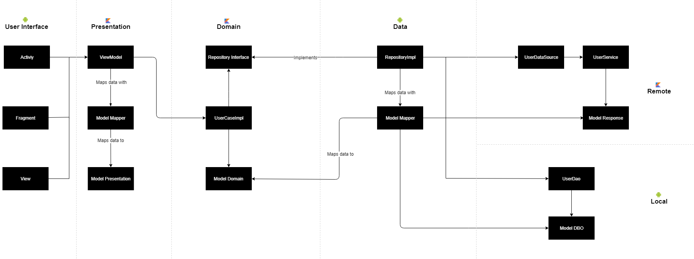
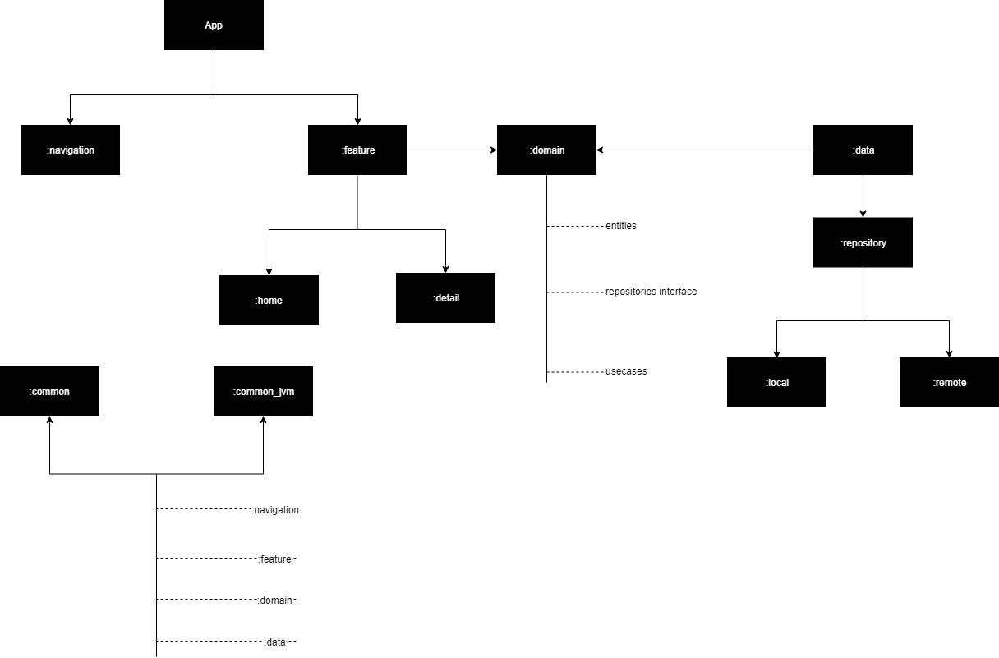

# Architecture Components

This application implements the following concepts :

MVVM + Data binding 
Multi-modules 
Navigation Component 
ViewModel 
LiveData 
Retrofit 
Coroutines 
Koin 
MockWebServer 
Mockk

# Architecture

# Multi module

